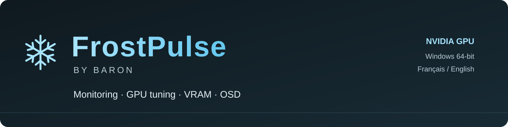
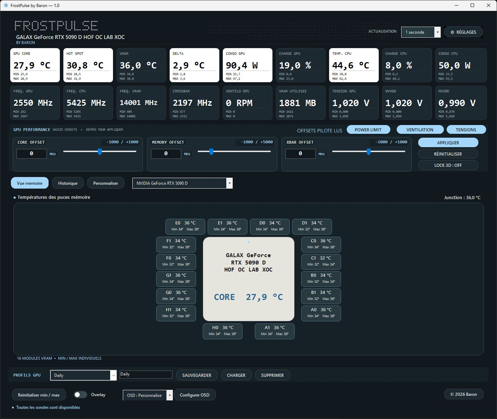

<strong><a href="https://github.com/BaronOC/FrostPulse/releases/latest">Download</a> · <a href="https://discord.gg/ETk7XmNFpB">Discord</a> · <a href="https://github.com/BaronOC/FrostPulse/discussions">Discussions</a> · <a href="https://github.com/BaronOC/FrostPulse/issues/new/choose">Report a bug</a> · <a href="README.md">Français</a></strong>

# FrostPulse by Baron

**Hardware monitoring, GPU tuning and in-game metrics in one Windows interface.**

I'm developing **FrostPulse** for hardware enthusiasts who want to understand their NVIDIA GPU, keep an eye on temperatures and access its controls in one place.

My goal is a tool that is clear enough for everyday use and detailed enough for advanced users. I also want to build a community around the project: your setups, feedback and ideas help me decide what to improve next.

*Screenshot from an RTX 5090 D setup. Available sensors and controls vary by GPU and driver.*

## Features

| Feature | What it offers |
| --- | --- |
| **GPU and CPU monitoring** | Available temperatures, hotspot and VRAM data, clocks, load, power, fan speed and memory usage. |
| **Min/max tracking** | Visible reference values throughout a session. |
| **GPU controls** | Core, Memory and XBAR offsets, power limit, fan control and Lock 3D on compatible setups. |
| **Voltage controls** | Available NVVDD / MSVDD readings and controls, explicit application and restoration of initial references. |
| **PCB / VRAM view** | Memory layout and individual module readings when exposed by the GPU. |
| **History and CSV** | Measurement history and exports for reviewing or sharing a session. |
| **Profiles and customization** | GPU profiles, colors, preferences and configurable OSD metrics. |
| **In-game OSD** | RTSS integration for compatible games and 3D applications. |
| **English and French** | Bilingual application and installer. |

## Download

1. Open the [latest Final release](https://github.com/BaronOC/FrostPulse/releases/latest).
2. Download **FrostPulse-1.0-Setup.exe** from **Assets**.
3. Run the installer, select your language and follow the steps.
4. Launch FrostPulse from the Start menu. A desktop shortcut is optional.

Profiles, colors, OSD settings and preferences are retained during updates.

**Release:** 1.0 Final · **Build:** September 20, 2026 · **Platform:** Windows 64-bit.

## Compatibility

FrostPulse targets **NVIDIA GPUs**, with a focus on **GeForce RTX 50 series** and features intended for **40, 30 and 20 series**.

Each sensor and control depends on the specific GPU, VBIOS and driver. Monitoring compatibility does not guarantee access to every advanced control. Individual VRAM temperatures are shown when the GPU actually exposes them. **RTSS is required for the in-game OSD.**

Help me document compatibility by sharing your exact GPU model, driver version and available features.

## Join the community

- Join [Discord](https://discord.gg/ETk7XmNFpB) to share your setup and meet other users.
- Use [Discussions](https://github.com/BaronOC/FrostPulse/discussions) for questions, ideas and feedback.
- Open an [Issue](https://github.com/BaronOC/FrostPulse/issues/new/choose) for reproducible bugs.
- Follow [Releases](https://github.com/BaronOC/FrostPulse/releases) for Final versions and release notes.

A star or a share helps other enthusiasts discover FrostPulse. Clear feedback, including reports about what does not work, is just as valuable.

This repository hosts Final releases, documentation and community feedback. The application's source code is not published here.

## Credits

FrostPulse by **Baron**. Hardware monitoring uses LibreHardwareMonitor; some features rely on PawnIO. The OSD integrates with RivaTuner Statistics Server. Trademarks belong to their respective owners. FrostPulse is an independent project, not an official NVIDIA product.
